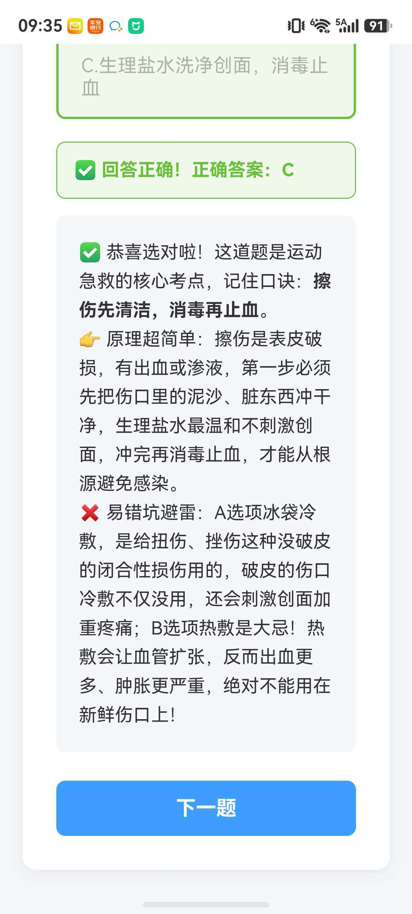

# 🏃 北京市初中体育与健康知识笔试刷题系统

一个简洁的体育知识在线练习系统，适配北京市初中体育笔试。**共收录 200 道题目**，涵盖：

- 运动损伤与急救（擦伤、扭伤、烫伤等）
- 消防安全（火灾逃生、急救电话等）
- 传染病防控（流感、乙肝、肺结核等）
- 营养与健康（合理膳食、肥胖预防等）
- 体育知识（田径、篮球、排球、奥运等）
- 心理健康（情绪调控、积极心态等）

**在线访问**：https://luyt12.github.io/beijing-pe-sports-quiz

## 📸 界面预览

### 答题界面


选择答案后即时显示对错，正确答案高亮显示。

### 解析界面



每道题配有详细解析（原理说明 + 易错坑点提醒），帮助理解记忆。

## ✨ 功能特点

- 📝 **逐题作答** - 一次只显示一道题，专注学习
- ✅ **即时判分** - 选择后立即显示对错
- 💡 **趣味解析** - 每道题都有详细解析和易错提醒
- 🔄 **错题复盘** - 答错会高亮正确答案
- 📱 **适配手机** - 支持移动端随时刷题

## 🚀 快速使用

### 方法一：直接打开（推荐）

直接在浏览器中打开 `index.html` 文件即可使用。

### 方法二：在线访问

访问 GitHub Pages：
https://luyt12.github.io/beijing-pe-sports-quiz

### 方法三：本地运行

```bash
# 克隆仓库
git clone https://github.com/luyt12/beijing-pe-sports-quiz.git

# 进入目录
cd beijing-pe-sports-quiz

# 用浏览器打开 index.html
```

## 📁 项目结构

```
beijing-pe-sports-quiz/
├── index.html   # 主页面（包含 200 道题目和所有代码）
└── README.md    # 说明文档
```

## 📖 题库说明

题库位于 `index.html` 文件底部的 JavaScript 代码中，格式如下：

```javascript
const questions = [
    {
        title: "题目内容",
        options: ["A. 选项1", "B. 选项2", "C. 选项3"],
        answer: "B",
        analysis: "✅ 答对啦！<br>👉 解析内容<br>❌ 易错提醒"
    }
];
```

### 添加新题目

在 `questions` 数组中添加新对象即可：

```javascript
const questions = [
    // 已有题目...
    {
        title: "新题目内容",
        options: ["A. 选项1", "B. 选项2", "C. 选项3"],
        answer: "C",
        analysis: "解析内容"
    }
    // 注意：最后一个题目后面不要加逗号
];
```

**注意**：
- 所有标点符号必须使用英文标点
- 引号、逗号、大括号都不能用中文的

## 📝 题目分类

### 选择题（1-100）
- 运动损伤与急救
- 消防安全
- 传染病防控
- 营养与健康
- 体育锻炼方法
- 心理健康

### 判断题（101-200）
- 运动安全与急救
- 传染病与健康
- 营养与饮食
- 视力保护
- 青春期健康
- 体育知识与礼仪
- 奥林匹克知识

## 🔧 自定义

如果想创建自己的题库，修改 `index.html` 中的 `questions` 数组即可。

## 📄 许可证

MIT License - 随意使用和修改

---

Made with ❤️ for Beijing PE Exam Students
